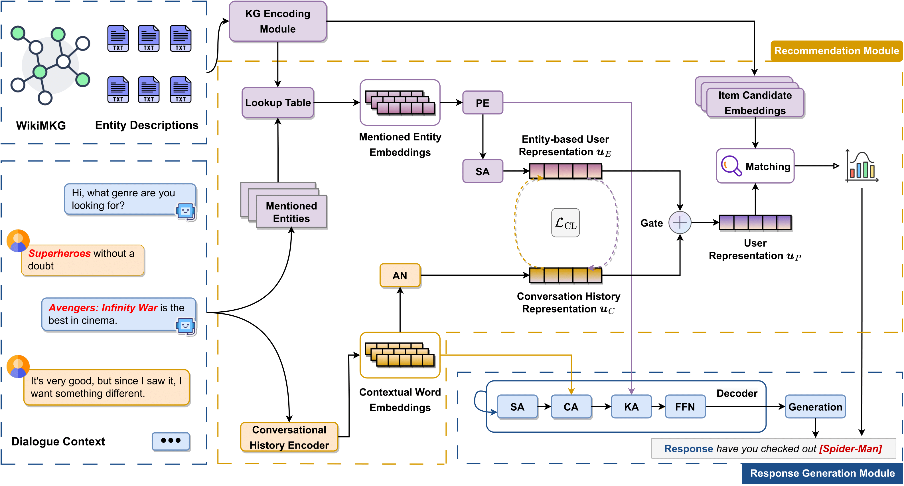

# KERL

[Knowledge Graphs and Pre-trained Language Models enhanced Representation Learning for Conversational Recommender Systems](https://arxiv.org/abs/2312.10967)



KERL leverages the power of knowledge graphs and pre-trained language models to generate semantically rich entity representations, enabling more accurate recommendations and engaging user interactions.

## Installation Instructions

To run the provided code, follow these steps:

1. **Download and install Miniconda**:

   ```bash
   wget https://repo.anaconda.com/miniconda/Miniconda3-latest-Linux-x86_64.sh
   bash Miniconda3-latest-Linux-x86_64.sh
   ```

2. **Create a new conda environment with provided `environment.yml` file**:

   ```bash
   conda env create -f environment.yml
   conda activate kerl
   ```

> :information_source: **Note:**
>
> 1. Code tested only on WSL2 and Linux-based systems.
> 2. The provided Miniconda installation commands are for Linux. For other systems, download the appropriate installer from the [official website](https://docs.conda.io/en/latest/miniconda.html).

## Quick-Start

To train the KERL model, use the following commands. Select the appropriate configuration file based on the dataset:

```bash
# For training on the Inspired dataset
python main.py -c config/inspired_kerl.yaml

# For training on the ReDial dataset
python main.py -c config/redial_kerl.yaml

```

> :information_source: **Note:** If you wish to log the training metrics, you will need a wandb account. Alternatively, you can use a CSV logger. For more details on setting up a wandb account, please refer to the [wandb quickstart guide](https://docs.wandb.ai/quickstart).

## Saved Models

You can download the saved models for two datasets from the following links:

1. Inspired Model: [Download](https://drive.google.com/file/d/1oSpNxq2vBppcqbf1GrUdspTUEDWLz_Ns/view?usp=sharing)
2. Redial Model: [Download](https://drive.google.com/file/d/1T4NQYiHgnn3AY4r2VUvZEg0Dq82bWrkU/view?usp=drive_link)

Place the downloaded `saved` folder in the root directory.
In the configuration file for the respective dataset, set `<phase>_reload` to `True`,
and `<phase>_model_path` with the path of the downloaded model.

## Citation

```
@article{10530439,
	title        = {Knowledge Graphs and Pretrained Language Models Enhanced Representation Learning for Conversational Recommender Systems},
	author       = {Qiu, Zhangchi and Tao, Ye and Pan, Shirui and Liew, Alan Wee-Chung},
	year         = 2024,
	journal      = {IEEE Transactions on Neural Networks and Learning Systems},
	volume       = {},
	number       = {},
	pages        = {1--15},
	doi          = {10.1109/TNNLS.2024.3395334}
}
```

## Acknowledgements

Parts of our implementation were inspired by the excellent [CRSLab toolkit](https://github.com/RUCAIBox/CRSLab). We are grateful to the CRSLab developers for open sourcing their valuable work.


